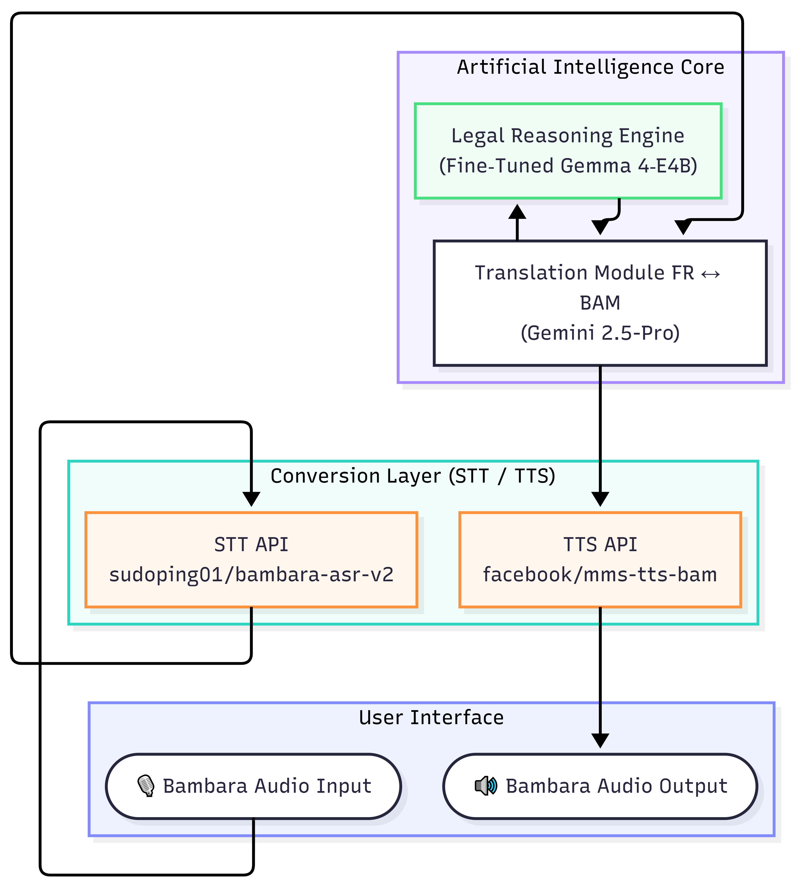

# ⚖️  Alia: Democratizing Ivorian Labor Law through Voice and Gemma 4
### Bridging the Legal Gap for Millions of Dioula/Bambara Speakers in Ivory Coast

[](https://www.kaggle.com/competitions/gemma-impact-challenge)
[]()
[]()

> **"Every challenge has a perfect match, and the clock is ticking. Real innovation happens when we build for the places that need it most. Coming off the heels of May Day (International Workers' Day), the gap between labor rights and labor reality has never been more apparent."**

**Alia** is a pioneering bilingual legal assistant designed to democratize access to labor law in Ivory Coast. Powered at its core by a fine-tuned **Gemma 4 model**, and extended through a modular voice-first pipeline, Alia provides millions of Bambara/Dioula speakers with direct, accurate, and actionable legal guidance in their native tongue.

---

## The Context & The "Wow" Factor

While the world recently celebrated International Workers' Day, for 90% of the Ivorian labor force, rights remain a luxury of the elite. In Ivory Coast, the **informal sector represents a large majority of employment in Côte d'Ivoire (commonly estimated between 80%–90% depending on the source) [ILOSTAT](https://ilostat.ilo.org/data/country-profiles/civ/)**. These workers—street vendors, agricultural laborers, small-scale mechanics—are theoretically protected by the Ivorian *Code du Travail*, but in reality, they operate completely outside of legal safety nets.

When an informal worker faces an unfair dismissal or hazardous working conditions, the barriers to justice are insurmountable:
1. **The Linguistic Divide**: The law is written in formal, complex French. While general literacy is improving, legal literacy in French remains a massive barrier for millions who communicate primarily in local languages like Bambara/Dioula.
2. **The Cost of Justice**: Seeking advice from a human lawyer is financially impossible for informal workers.

**Alia breaks this barrier.** It strips away the requirements for literacy, French fluency, and legal fees. A user simply speaks their legal problem in Bambara. Alia processes the audio, consults a highly specialized Gemma 4 "Legal Brain", and speaks the legal advice back to them in their native tongue.

This is true **Digital Equity**—putting the power of the law directly into the hands of the workers who build the country, closing the justice gap for 90% of the workforce.

---

## How We Implemented Gemma 4 (The "Source of Truth")

To build a model capable of understanding and citing complex Ivorian law without hallucinating, we could not rely on standard Retrieval-Augmented Generation (RAG) alone. We needed a model that natively "spoke" the law.

We chose **`unsloth/gemma-4-E4B-it`** as our base model. Its parameter efficiency makes it ideal for cost-effective deployment (a critical requirement for public-service/NGO tools), while maintaining strong instruction-following and reasoning capabilities.

### 1. Curating the Ivorian Legal Dataset
We digitized and structured a structured corpus of Ivorian labor law and related legal texts of the Ivorian Labor Code and Social Security laws into **2,357 discrete JSON files**. Each file represents a specific article (e.g., `art_100_loi_n_99_477_du_02_aout_1999_portant_modification_du_code_de_prevoyance_sociale.json`), containing metadata such as the legal field, chapter, status (e.g., "EN VIGUEUR"), and the exact textual content.

### 2. Synthetic Conversational Generation
Using a custom Python pipeline, we transformed these 2,357 static JSON files into a rich, multi-turn conversational dataset. For every single article, our script automatically generated diverse User/Assistant interactions.

Here is an excerpt of how we engineered the training data:

```python
def generate_examples(entry):
    titre = entry.get("text_juridique_name", "")
    article_num = entry.get("article_num", "")
    contenu = extract_article_content(entry.get("text", ""))

    system_prompt = (
        "Tu es un assistant juridique spécialisé en droit ivoirien. "
        "Tu connais les lois, décrets et règlements de la République de Côte d'Ivoire. "
        "Réponds avec précision en citant les textes applicables."
    )

    examples = [
        {"conversations": [
            {"role": "system",    "content": system_prompt},
            {"role": "user",      "content": f"Que dit l'article {article_num} de la {titre} ?"},
            {"role": "assistant", "content": f"L'article {article_num} de la {titre} prévoit :\n\n{contenu}"}
        ]},
        # Additional conversational turns for broad domain questions and definitions...
    ]
    return examples
```

### 3. Supervised Fine-Tuning (SFT) & Grounding
By training `unsloth/gemma-4-E4B-it` on this conversational dataset using LoRA adapters, the model learned the specific cadence, structure, and exact citations of Ivorian law. The resulting weights (`julienawonga/gemma-4-ivorian-labor-law-merged`) ensure that when Alia answers a question, it grounds its response by explicitly citing the relevant article, refusing out-of-domain prompts and significantly reduces hallucinations by encouraging grounded, article-based responses.

---

## Technical Architecture

Alia utilizes a multi-model, cost-optimized pipeline orchestrated by LangGraph to handle the complexities of voice and memory:

<p align="center">
  
</p>
---

## 🛠️ The Engine: Technical Rigor & Production Architecture

The `engine/` directory contains the complete lifecycle of the Alia assistant, proving the engineering depth behind the demo.

### 1. Advanced Fine-Tuning (`engine/fine-tuning/`)
- **Notebook**: [`engine/fine-tuned-gemma4-unsloth.ipynb`](./engine/fine-tuned-gemma4-unsloth.ipynb)
- **Base Model**: `unsloth/gemma-4-E4B-it` (optimized for parameter-efficient fine-tuning).
- **Methodology**: Supervised Fine-Tuning (SFT) using **LoRA** (Rank 16, Alpha 16).
- **Optimization**: We utilized the `train_on_responses_only` technique to ensure the model’s loss calculation focused exclusively on legal accuracy in the assistant's responses.

### 2. Export & Model Fusion (`engine/export_and_fusion/`)
- **Process**: Merged LoRA adapters back into the base model in **16-bit (bfloat16)** precision.
- **VLLM Compatibility**: Automated cleaning of `config.json` (removing PEFT traces) to allow the model to run natively as a `Gemma4ForConditionalGeneration` architecture in high-performance serving engines.

### 3. Production Deployment (`engine/deployment/`)
- **Legal LLM**: Deployed via **vLLM** on Google Cloud Run with **GPU acceleration (L4)**, providing OpenAI-compatible endpoints with sub-second latency.
- **Speech Stack**: A dedicated FastAPI service managing:
    - **ASR**: `sudoping01/bambara-asr-v2` for high-fidelity Bambara transcription.
    - **TTS**: `facebook/mms-tts-bam` for natural-sounding Bambara speech synthesis.
    - **Security**: Secured via GCP Secret Manager and custom API Key headers.

---

## Repository Structure

- `app.py`: The main Streamlit bilingual UI (French/Bambara) and entry point.
- `pipeline/orchestrator.py`: The LangGraph state machine managing the multi-model flow.
- `services/legal_llm.py`: Integration with the fine-tuned Gemma 4 API.
- `services/translation.py`: Multilingual bridge (Bambara ↔ French), currently powered by Gemini API (planned migration to Gemma 4 multilingual in next iteration)
- `Dockerfile`: Production-ready, stateless container configuration for Google Cloud Run.
- `config.yaml`: Secure authentication and session management.

---

## Local Setup & Deployment

### Prerequisites
- Python 3.12+
- `uv` (recommended) or `pip`

### Pre-Installation
- Go to engine/deployement
- Deploy the legal LLM on GPU-accelerated Cloud Run and note the endpoint URL.
- Deploy the Speech API on Cloud Run and note the endpoint URL.
- Set up GCP Secret Manager with your API keys for Gemini, LLM, and Speech services.

### 1. Installation
```bash
git clone https://github.com/julienawonga/alia-legal-assistant.git
cd alia-legal-assistant
uv venv
source .venv/bin/activate  # On Windows: .\.venv\Scripts\activate
uv pip install -r requirements.txt
```

### 2. Environment Variables
Copy the example environment file and fill in your API keys:
```bash
cp .env.example .env
```

### 3. Run Locally
```bash
uv run streamlit run app.py
```
The application will be available at `http://localhost:8501`.

### 4. Deploy to Google Cloud Run
The application is fully Dockerized and ready for serverless deployment:
```bash
gcloud run deploy alia-app \
    --source . \
    --region <REGION> \
    --allow-unauthenticated \
    --set-secrets="GEMINI_API_KEY=GEMINI_API_KEY:1,LLM_API_KEY=LLM_API_KEY:1,SPEECH_API_KEY=SPEECH_API_KEY:1"
```
We deployed our fine-tuned **Gemma 4-E4B** on Cloud Run with **NVIDIA L4 GPUs**, leveraging **scale-to-zero** to ensure a production-ready yet cost-efficient architecture. This setup allows Alia to be highly responsive when needed while incurring zero costs during idle periods.

## ⚖️ Deployment Trade-offs

### Why Cloud GPU for the Hackathon?

We deploy Gemma 4 on GPU infrastructure to:

- Ensure low latency for voice interactions (<2s)
- Provide a stable and testable demo environment
- Showcase the full capabilities of the model

### Path to Real-World Accessibility

For real-world deployment in low-resource environments:

- Quantized Gemma 4 (4-bit) can run on consumer hardware
- Offline inference removes dependency on internet access
- Community-based deployment (NGOs, local centers)

**Hackathon = reliability and demonstration**  
**Real-world = accessibility and decentralization**

---

## Limitations

- The model is trained on a subset of Ivorian legal texts and may not cover all edge cases.
- Responses are generated based on static legal data and may not reflect recent legal updates.
- The assistant does not replace professional legal advice.
- Bambara translation quality depends on external models and may introduce noise.
- Translation layer currently depends on Gemini API 
  (not fully open-source — roadmap item for Gemma 4 migration).
- Benchmark scores similar to base model on general metrics; 
  domain-specific advantage requires Ivorian-specific evaluation sets.

---
## Why Not RAG?

We deliberately chose fine-tuning over a pure RAG approach:

- Legal answers require structured, repeatable citation patterns
- The dataset is relatively bounded and stable
- Fine-tuning improves latency and reduces system complexity

However, future iterations could combine SFT + RAG for improved coverage and updatability.

---

## Collaborators
- [Add Collaborator Name] - [Role/Contribution]
- **Julien Awon'ga** - Data Scientist

## 📦 Artefacts & Submission Links
- **Video Pitch**: [YouTube Link](https://youtu.be/BJsQIniDFeo)
- **Fine-Tuning Notebook**: [`engine/fine-tuned-gemma4-unsloth.ipynb`](./engine/fine-tuned-gemma4-unsloth.ipynb)
- **Gemma 4 Weights**: [[HuggingFace](https://huggingface.co/julienawonga/gemma-4-ivorian-labor-law-merged/)]
- **Public Repository**: [GitHub Link](https://github.com/julienawonga/alia-legal-ai)

*Built with ❤️ for the Gemma Impact Challenge.*
